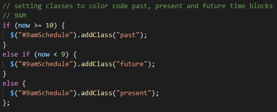
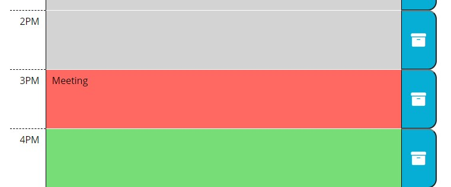

# Work Day Scheduler

The aim of this project was to create a schedule where the user can enter the tasks they need to do in to the different time blocks throughout the day. When the user refreshes the page, the tasks remain visible. Also, the time blocks are colour coded to represent past (grey), present (red) and future (green) tasks. To view this project [Click here!](https://silvia-taliana.github.io/work-day-scheduler/)

## Installation

This assignment was completed using JQuery and an external library called Moment.JS. 

To set the current date and time, Moment.JS was called with the following code:

This particular format displays the time and date like this: 
January 14th 2021, 1:14 pm
However other formats are available from Moment JS.

To make sure that each task is saved when the user clicks the save button, there needed to be a function that stores the task into the local storage: 

This stores the task in an array, and the JSON.stringify changes the array into a string. 

Then whenever the page is refreshed, the stored task needs to be retrieved and displayed back on the screen so the user does not lose their input. JSON.parse retrieves the item, and .append displays it on the screen. 

Finally, the time blocks were all colour coded for past present and future. This was done using if/else statements. This statement is stating: IF the current time is more than (after) 10am, then add the class of "past" to this time block; ELSE IF the time is less than (before) 9am, add the class of "future"; ELSE add the class of "present" because the current time must be 9am. 

## Usage

The following represents the colour coding if the current time was 3pm: 

## License
Creative Commons Attribution 4.0 International Public License

MIT License